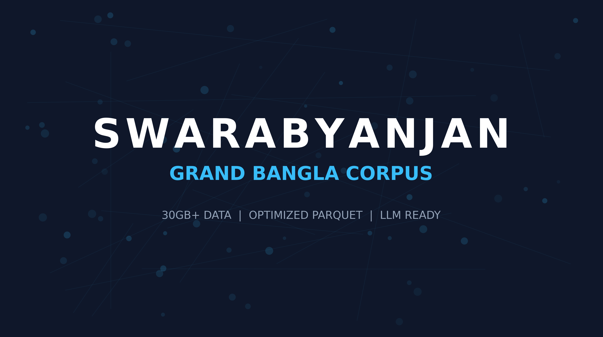

# 🇧🇩 Swarabyanjan: Grand Bangla LLM Corpus Pipeline



> **A robust data engineering pipeline to aggregate, clean, and optimize over 30GB of Bangla news data into a unified Parquet corpus.**

[](https://kaggle.com/datasets/a6ec6016d092007de80f8969076212c4aa90393dceb8e3ac19993e9335f24b8c)

## 📖 Overview
**Swarabyanjan** is an initiative to solve the data scarcity problem for Bengali Large Language Models (LLMs). This repository contains the preprocessing logic used to create the **Swarabyanjan Grand Corpus**.

We aggregated raw data from 8+ scattered sources (CSV, JSON, JSONL), cleaned the schema, and optimized the storage format, reducing the dataset size from **30GB (Raw)** to **~6GB (Optimized Parquet)** without data loss.

## 📂 Dataset Link
The processed dataset is hosted on Kaggle due to size constraints.
👉 **[Download Swarabyanjan Grand Corpus Here](https://kaggle.com/datasets/a6ec6016d092007de80f8969076212c4aa90393dceb8e3ac19993e9335f24b8c)**

## 🏗️ Pipeline Architecture

The pipeline (`notebooks/01_data_unification.ipynb`) performs the following steps:

1.  **Ingestion:** Handles massive JSON dumps (up to 21GB single files) and thousands of CSVs.
2.  **Schema Standardization:**
    * Maps diverse headers (e.g., `heading`, `content`, `article`) to a unified `['headline', 'body', 'source']` schema.
3.  **Optimization:**
    * Converts heavy text files into **Apache Parquet** format.
    * Uses **Snappy Compression** for fast I/O.
    * Chunks large files to prevent RAM overflow during training.

## 📊 Data Statistics

| Metric | Details |
| :--- | :--- |
| **Input Size** | > 30 GB (Raw) |
| **Output Size** | ~ 6 GB (Compressed) |
| **Format** | Apache Parquet |
| **Total Articles** | 4 Million+ (Approx) |
| **Primary Sources** | Prothom Alo, Jugantor, Ittefaq, BDNews24, HuggingFace Archives |

## 🚀 How to Use the Dataset

Once you download the dataset from Kaggle, you can load it instantly in Python:

```python
import pandas as pd
import glob

# Load all optimized chunks
files = glob.glob("path/to/swarabyanjan_final_dataset/*.parquet")
df = pd.read_parquet(files)

print(f"Loaded {len(df)} articles successfully!")
